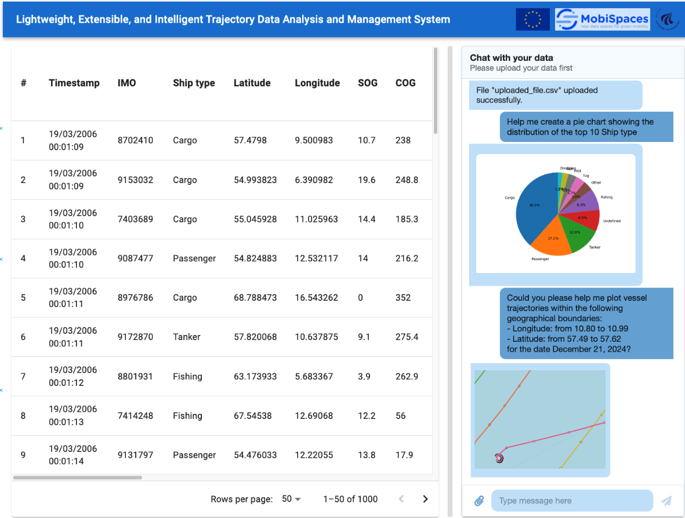

# LEISystem - Lightweight Extensible Intelligent Trajectory Data Analysis and Management System

## System Overview
An intelligent trajectory analysis platform built with React+Flask, integrating natural language interaction, multimodal data visualization, and real-time data processing capabilities. Supports multidimensional analysis and management of vessel trajectory data.

## Core Features
- **Multi-source Data Support**: CSV format trajectory data upload and parsing 
- **Intelligent Interaction**:
  - Natural language-driven data query and operations 
  - GPT-4o powered semantic understanding and task decomposition
- **Multidimensional Visualization**:
  - Dynamic adjustable split-layout tables 
  - Interactive trajectory map rendering 
  - Real-time statistical chart generation 
- **Extensibility**:
  - R-Tree spatial index implementation 
  - Modular data processing pipeline 

## Technical Architecture
```plaintext
Frontend: React 18 + Material-UI + Leaflet
Backend: Flask + Pandas + LangChain
AI: GPT-4o + Custom Toolchain
Storage: In-memory data cache + Local file storage
```

## Quick Start
```bash
# Frontend
cd client
npm install
npm run dev

# Backend
pip install -r requirements.txt
python app.py
```

## Configuration Requirements
1. Set OpenAI API key 
2. Prepare static resources directory 
3. Install Leaflet icon dependencies 

## API Endpoints
```plaintext
POST /api/upload    # Data upload
GET  /api/data      # Data retrieval
POST /api/chat      # Natural language interaction
```

## Extension Development
1. Add new data tools 
2. Extend visualization components 
3. Modify data processing pipeline 

> Detailed design documentation available in `/docs` directory

